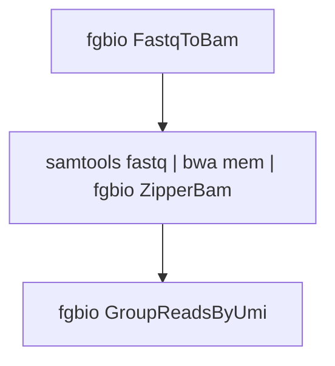
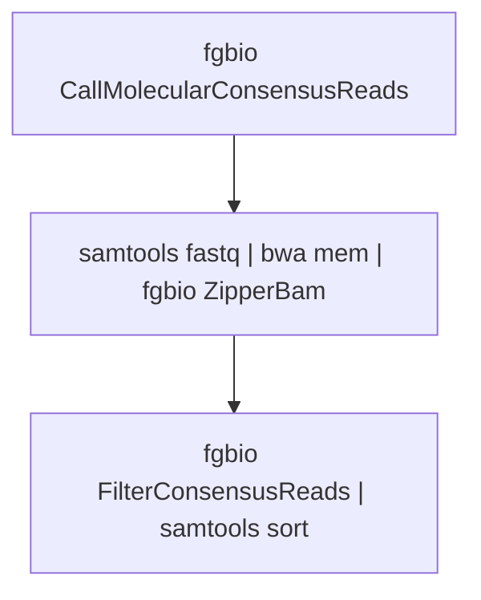
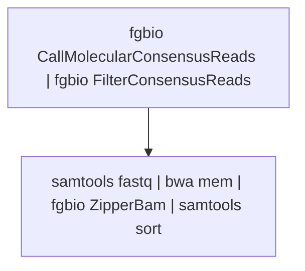

# fgbio Best Practise FASTQ -> Consensus Pipeline

This document describes the best practise(s) for building pipelines to go from FASTQ files that contain a mixture of template (genomic) bases and UMI bases, through to aligned and filtered consensus reads.  

The pipeline is broken into two phases:

1. Getting to aligned and grouped raw reads (identifying which reads are from the same source molecules)
2. Going from grouped raw reads to aligned and filtered consensus reads

We provide two alternatives for the second phase.  One intended for R&D environment where it is desirable to be able to branch off from the pipeline and test e.g. multiple consensus calling or filtering parameters.  The other is intended for high throughput production environments where performance and throughput take precedence over flexibility.

## Tools used

The steps described below use a mixture of:

- `fgbio` (version 2.0 or higher)
- `samtools` (version 1.14 or higher)
- `bwa mem`

## Notes on some common options

The `fgbio` toolkit exposes some common options in addition to those supported by each tool.  The general form of running fgbio is:

```shell
fgbio <common options> Tool <tool options>
```

The following options are frequently used to optimize performance:

### Compression

`--compression` can be used to control the GZIP compression level used when writing BAM files and other gzip compressed files.  The default value is `5`.  Lower values yield less compression (and larger file sizes) but less CPU usage and shorter runtimes.  The recommendation is to set compresion level as follows:

* When outputting file(s) that will be retained as outputs of the pipeline, use the default `--compression 5`
* When outputting file(s) that are inputs to subsequence tools but are discarded at or before the end of the pipeline use `--compression 1`.  Compression level 1 uses a _lot_ less CPU than level 5, but still generates substantially smaller files than turning compression off with level 0.  We have found this to be a good tradeoff for intermediate files that must be written to disk where both compression time and disk IO can be limiting.
* When outputting to `stdout` and piping into another tool use `--compression 0` to avoid compression

### Async IO

`--async-io` causes additional threads to be used to i) read ahead and decompress/decode reads when reading SAM, BAM and VCF files, and ii) for encoding and compression when writing SAM, BAM and VCF files.
Each file being read or written is allocated one additional thread.
So for example, a tool that reads one BAM file and writes one BAM file will end up using three threads (one reader, one worker, one writer).
While the additional threads offer some increase in performance by off-loading work from the main/worker thread, depending on the tool in use, they may offer anything from a very minor performance boost to a significant one.

We recommend using `--async-io` in places where compressed outputs are being written _and_ the tool in use needs more than a nominal amount of CPU for non-IO activities.

## Phase 1: FASTQ -> Grouped BAM

The first phase deals with going from FASTQ files through to aligned and grouped BAM files.  The general structure of this phase is:



In this example we'll use a single sample with paired-end fastq files and an inline 8bp UMI at the beginning of read one (see the fgbio [Read Structure](https://github.com/fulcrumgenomics/fgbio/wiki/Read-Structures) page for how to specify other UMI setups).

### Step 1.1: FASTQ -> uBam

This step extracts the UMI bases and stores them in standard SAM tags.  It can extract any number of inline UMIs within the sequencing reads, and optionally by providing the `--extract-umis-from-read-names` flag, UMIs from the read names.  Downstream `fgbio` tools expect the UMIs to be stored in tags in the BAM file (e.g. `RX:Z:ACTGCTAG`); converting to a uBam as the first step is the easiest way to do this correctly.

When working with fully degenerate UMIs that cannot be error-corrected, the uBam should be generated as follows:

```bash
fgbio -Xmx1g --compression 1 --async-io FastqToBam \
  --input r1.fq.gz r2.fq.gz \
  --read-structures 8M+T +T \
  --sample s1 \
  --library library1 \
  --platform-unit ABCDEAAXX.1 \
  --output s1.unmapped.bam
```

If, however, the UMIs are a limited and non-fully degenerate set then they can be error-corrected after extraction from the reads as follows:
  
```bash
fgbio -Xmx1g --compression 0 FastqToBam \
  --input r1.fq.gz r2.fq.gz \
  --read-structures 8M+T +T \
  --sample s1 \
  --library library1 \
  --platform-unit ABCDEAAXX.1 \
  --output /dev/stdout \
  | fgbio -Xmx2g --compression 1 --async-io CorrectUmis \
      --input /dev/stdin \
      --output s1.unmapped.bam \
      --max-mismatches 1 \
      --min-distance 2 \
      --umi-files file-of-expected-umis-one-per-line.txt \
      --dont-store-original-umis
```

Neither option above requires or performs any sorting.

### Step 1.2: uBam -> Mapped BAM

This step uses a combination of `samtools` (to convert the uBam back to FASTQ), `bwa mem` to do the actual alignment and `fgbio ZipperBams` to carry metadata and UMIs forward from the unmapped BAM.  No sorting is performed in this step.

```  
# Align the data with bwa and recover headers and tags from the unmapped BAM
samtools fastq s1.unmapped.bam \
  | bwa mem -t 16 -p -K 150000000 -Y ref.fa \
  | fgbio -Xmx4g --compression 1 --async-io ZipperBams \
      --unmapped-bam s1.unmapped.bam \
      --ref ref.fa \
      --output s1.mapped.bam 
```

Some important `bwa mem` options used here are:

- `-t 16` to set the number of threads to use to 16; this can be set to any number between 1 and the number of CPU cores available
- `-K 150000000` to tell `bwa` to process reads/bases in fixed size chunks regardless of the number of threads; this makes `bwa` deterministic and reproducible with different thread counts
- `-Y` to use soft-clipping (instead of hard clipping) in supplemental alignments

Under no circumstances should `-M` be used to `mark shorter split hits as secondary` as this will cause problems with downstream tools.


### Step 1.3: Mapped BAM -> Grouped BAM

This step identifies reads or read pairs that originate from the same source molecule based on genomic positions and UMI.  For _most_ data this is the recommended way to run grouping:

```  
# Group the reads by position and UMI
fgbio -Xmx8g --compression 1 --async-io GroupReadsByUmi \
  --input s1.mapped.bam \
  --strategy Adjacency \
  --edits 1 \
  --output s1.grouped.bam \
  --family-size-histogram s1.tag-family-sizes.txt
```

However:

1. If UMIs are significantly longer (e.g. 20bp) or have more errors, `--edits` can be increased
2. For multiplex PCR and similar data where reads' genomic positions are fixed by the primers it is recommended to use `--strategy Identity` to reduce runtime at the expense of lower accuracy


## Phase 2(a): GroupedBam -> Filtered Consensus, R&D Version




### Step 2(a).1: GroupedBam -> Consensus uBam

This step generates unmapped consensus reads from the grouped reads.  Depending on your data you may choose to raise or lower the `--min-input-base-quality` to accept or reject more bases from the grouped raw reads.  In an R&D setting it is frequently useful to see _all_ consensus reads, but there is a performance trade-off.  Frequently a very large fraction of molecules will have only a single read[-pair]; if consensus reads with depth 1 will be discarded later, setting `--min-reads 2` (or higher) can cause this step to run significantly faster.

```bash
fgbio -Xmx4g --compression 1 CallMolecularConsensusReads \
  --input s1.grouped.bam \
  --output s1.cons.unmapped.bam \
  --min-reads 1 \
  --min-input-base-quality 20 \
  --threads 4
```

### Step 2(a).2: Consensus uBam -> Consensus Mapped BAM

Remapping the consensus reads is nearly identical to mapping the raw reads, with the addition of the `--tags-to-reverse` and `--tags-to-revcomp` options.  As specified below, these cause the per-base tags generated by consensus calling to be reversed and/or reverse complemented on reads mapped to the negative strand, so that they are in sync with the read's bases and quality scores.

The `-Y` flag to `bwa` (causing it to soft-clip instead of hard-clip supplemental alignments) is critical at this step otherwise the per-base tags from the consensus caller will get out of sync with the read's bases and quality scores.

```
# Re-align the consensus reads
samtools fastq s1.cons.unmapped.bam \
  | bwa mem -t 16 -p -K 150000000 -Y ref.fa \
  | fgbio -Xmx4g --compression 1 --async-io ZipperBams \
      --unmapped-bam s1.cons.unmapped.bam \
      --ref ref.fa \
      --tags-to-reverse Consensus \
      --tags-to-revcomp Consensus \
      --output s1.cons.mapped.bam 
```

### Step 2(a).3: Consensus Mapped -> Consensus Filtered & Sorted BAM

Finally we take the mapped consensus reads, filter them and sort them ready for downstream analysis.  The parameters to `FilterConsensusReads` will need tuning based on the specific library preparation technology _and_ the downstream analysis needs.  The filtering parameters presented here (`--min-reads 3 --min-base-quality 45 --max-base-error-rate 0.2`) aim for a balance between generating high quality consensus reads and yield of consensus reads.  This step can be repeated one or more times with different filtering criteria using the same consensus mapped BAM to explore different filtering strategies.

```      
# Filter and sort the consensus reads
fgbio -Xmx8g --compression 0 FilterConsensusReads \
  --input s1.cons.mapped.bam \
  --output /dev/stdout \
  --ref ref.fa \
  --min-reads 3 \
  --min-base-quality 45 \
  --max-base-error-rate 0.2 \
  | samtools sort --threads 8 -o s1.cons.filtered.bam --write-index
```


## Phase 2(b): GroupedBam -> Filtered Consensus, HT Version

For a high throughput production pipeline looking to maximize throughput and minimize turaround time, the following pipeline is recommended:



### Step 2(b).1: GroupedBam -> Filtered Consensus uBam

This step generates unmapped consensus reads from the grouped reads and immediately filters them.  

```bash
min_reads=3  # Mirrors the setting in 2(a).3 

fgbio -Xmx4g --compression 0 CallMolecularConsensusReads \
  --input s1.grouped.bam \
  --output /dev/stdout \
  --min-reads $min_reads \
  --min-input-base-quality 20 \
  --threads 4 \
  |  fgbio -Xmx8g --compression 1 FilterConsensusReads \
       --input /dev/stdin \
       --output s1.cons.unmapped.bam \
       --ref ref.fa \
       --min-reads 3 \
       --min-base-quality 45 \
       --max-base-error-rate 0.2
```

### Step 2(b).2: Consensus Filtered uBam -> Consensus Mapped & Filtered BAM

This step is similar to the re-mapping in 2(a).2, but since the uBam has already been filtered, we have `ZipperBams` output uncompressed BAM and pipe it immediately into `samtools` to coordinate sort and index the resulting BAM ready for analysis.

The `-Y` flag to `bwa` (causing it to soft-clip instead of hard-clip supplemental alignments) is critical at this step otherwise the per-base tags from the consensus caller will get out of sync with the read's bases and quality scores.

```
# Re-align the consensus reads
samtools fastq s1.cons.unmapped.bam \
  | bwa mem -t 16 -p -K 150000000 -Y ref.fa \
  | fgbio -Xmx4g --compression 0 --async-io ZipperBams \
      --unmapped-bam s1.cons.unmapped.bam \
      --ref ref.fa \
      --tags-to-reverse Consensus \
      --tags-to-revcomp Consensus \
  | samtools sort --threads 8 -o s1.cons.filtered.bam --write-index 
```
